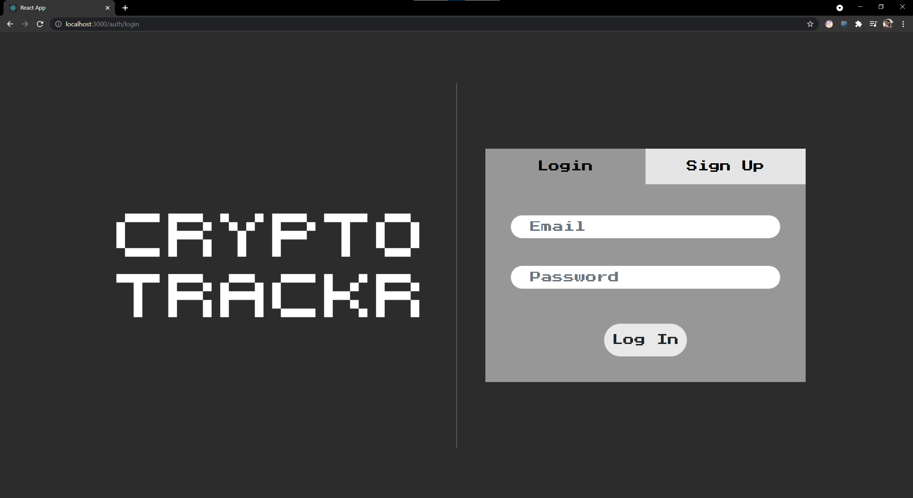
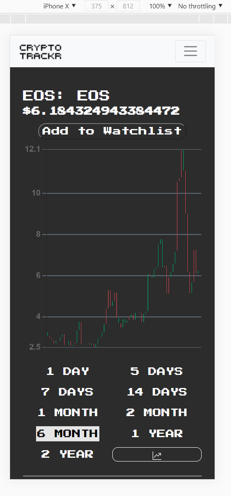

# Crypto Trackr – Team Doge

This project was developed for Cal Poly's CS307 by Jin Choi, Tessa Tapmongkol, Hadi Asemi, and Wesly Ortega. 

It was developed using a React frontend and a Flask backend. The web app's main purpose is to allow for the searching and tracking of cryptocurrency prices. 

Users are able to create an account or login onto an existing account. 

 

Once in their accounts, users are able to search for a specific cryptocurrency and add them into their watchlist. The watchlist can be arranged in any way that the user sees fit.

The website is responsive and can adapt to devices of different resolutions.

## UI Prototype
Our initial prototype (link below) was last updated on April 26
https://www.figma.com/file/MqulgZsxN8o4MrhXMbaP05/Untitled?node-id=0%3A1

## Installation
Detailed instructions on how to set up the frontend and backend can be found in their respective folders. The general requirements are to have pip (or any package manager) and npm installed.